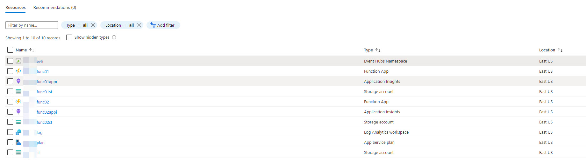

# Introduction

This project demonstrates the following:

* Function to spam an Event Hub with messages, see `FunctionApp1` and `Function1`.
* Function to uploaded file(s) and addd to Blob Storage, see `FunctionApp1` and `Function2`, using `DefaultAzureCredentials` for authentication.
* Function to pull messages off of Event Hub, see `FunctionApp2` and `Function1`. 

`Function0` functions are health check end points that return the name of the function and the current assembly version.

This project include a ConsoleApp to spam the endpoint.

From Visual Studio Code you can spam the endpoint running the following code in the Terminal window.

```bash
dotnet run --project .\ConsoleApp1\ --file-name .\ConsoleApp1\Sample2.json --end-point "FUNCTION_END_POINT" -quantity 10
```

The supported parameters are as follows:

* `--file-name` The location of the file to upload.
* `--end-point` The Azure Function Url.
* `--quantity` The number of times to call the end point.

## Azure

The Azure environment consists of the following:

* (1) Resource Group
* (1) Event Hub, Basic Pricing Tier
* (1) Storage Account
* (1) App Service Plan, P1V2, Linux
* (2) Function Apps, added to the App Service Plan
* (2) App Insights, one for each Function App
* (2) Azure Storage, one for each Function App



## Links

Azure Function Timeouts <https://docs.microsoft.com/en-us/azure/azure-functions/functions-scale#timeout>

Managing Connections <https://docs.microsoft.com/en-us/azure/azure-functions/manage-connections>

Configuration Reference for `host.json` <https://docs.microsoft.com/en-us/azure/azure-functions/functions-host-json>